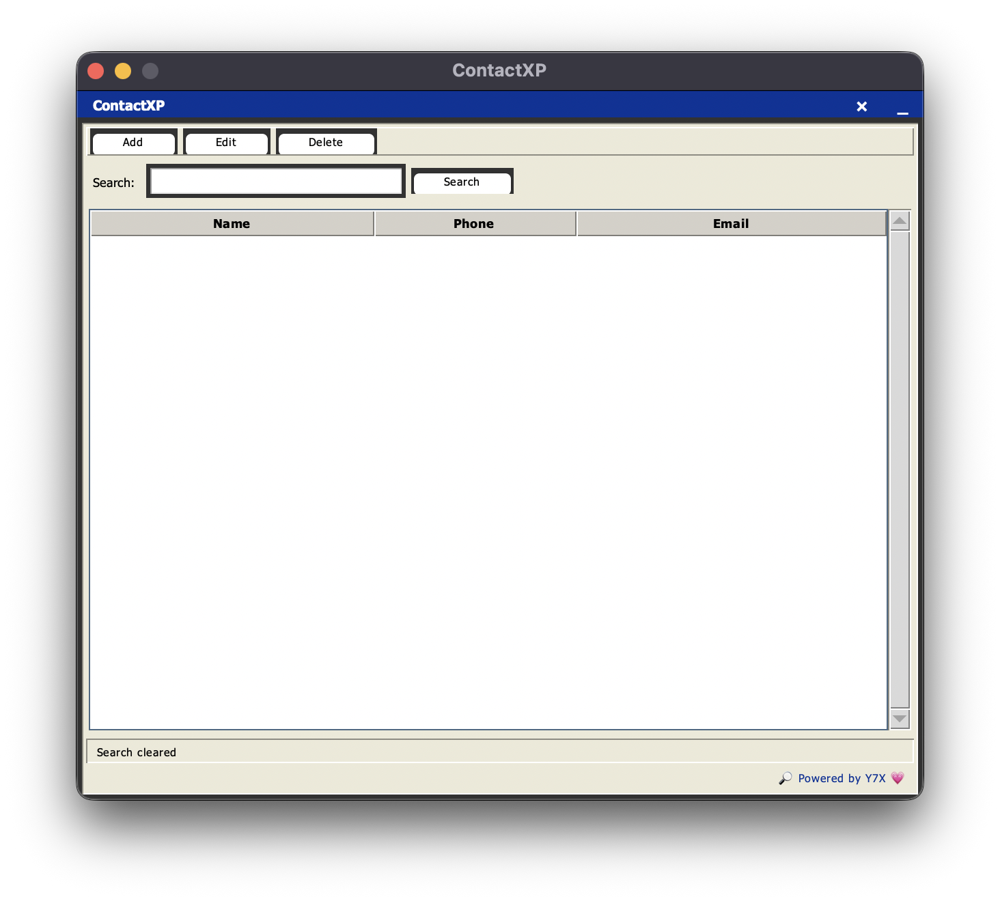

<div align="center">

# 🗂️ ContactXP 
**🖥️ Classic XP look, modern flow — ContactXP flex**

Your ultimate classic Windows XP style contact book 
A clean, nostalgic contact manager with a retro XP theme — smooth, simple, and reliable.
Branded with 💗 by [Y7X-bit](https://github.com/Y7X-bit)



</div>

---

## 🌟 Features at a Glance

- **Retro Windows XP UI** vibes with authentic colors & style  
- Add, Edit, Delete contacts easily  
- Instant Search through contacts by name, phone, or email  
- Clean, scrollable contact list with XP-style scrollbar  
- Status bar updates with friendly messages  
- Persistent contact storage via `contacts.json`  
- Chill branding label: 🔎 Powered by Y7X 💗  

---

## 🖥️ Installation

> Python 3.9 or later required

```bash
git clone https://github.com/Y7X-bit/ContactXP.git
cd ContactXP
pip install -r requirements.txt
python RetroXP.py